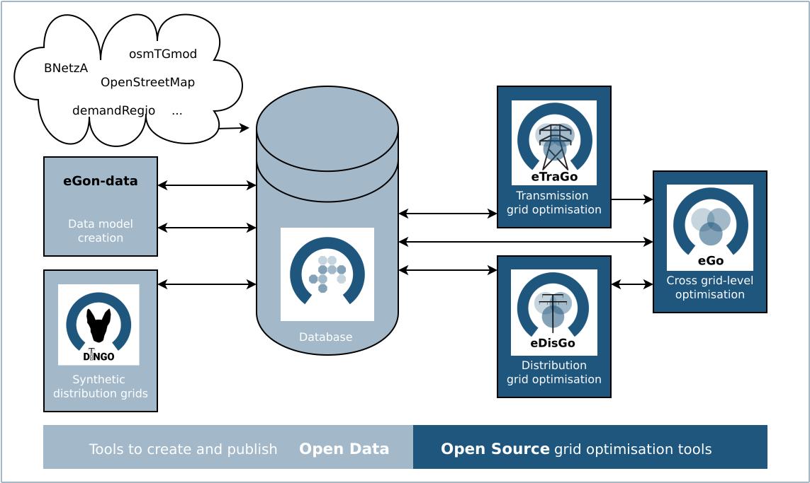

============
About eTraGo
============

eTraGo stands for **e**\lectric **Tra**\nsmission **G**\rid **o**\ptimization.

The python package eTraGo provides optimization strategies of flexibility options 
for transmission grids based on PyPSA. A peculiarity in this context is that 
the German transmission grid is described by the 380, 220 and 110 kV voltage levels. 
Conventionally the 110kV grid is part of the distribution grid. The integration of 
the transmission and ‘upper’ distribution grid is part of eTraGo.

The focus of optimization are flexibility options with a special focus on
energy storage and grid expansion measures.

Research projects
====================
This software project was initially developed in the research project
`open_eGo <https://openegoproject.wordpress.com>`_.
It is constantly further developed in different reserach projects, 
e.g. `eGon <https://ego-n.org/>`_ and `PoWerD <https://www.h2-powerd.de/>`_. 

The OpenEnergy Platform
=======================
Within the open_eGo project we developed the OpenEnergy Platform which this software
is using in order to get and store the in- and output data. Before you start to
calculate a registration on the platform is needed. For more information see
`openenergy-platform <https://openenergy-platform.org/>`_ and login.

The OpenEnergy platform mainly addresses students, researchers and scientists in 
the field of energy modelling and analytics as well as interested persons in 
those fields. The platform provides great tools to make your energy system 
modelling process transparent. All data of the open_eGo project are stored at
this platform. 
`Learn more about the database access <https://oep-data-interface.readthedocs.io>`_.

Model overview
==============

eDisGo
======
The python package eDisGo provides a toolbox for analysis and optimization
of distribution grids. It is closely related to the python project Ding0 as this
project is currently the single data source for eDisGo providing synthetic
grid data for whole Germany. `Learn more here <http://edisgo.readthedocs.io/>`_.

eGo
===

The python package eGo is a toolbox and application which connects the tool eTraGo
(optimization of flexibility options at transmission grid level)
and eDisGo (optimization of distribution grids). All those python
packages were initially developed in the research project 
`open_eGo <https://openegoproject.wordpress.com>`_. 
`Learn more here <http://openego.readthedocs.io/>`_.

Data model creation
===================
For the eGon project the python-tool `eGon-data <https://github.com/openego/eGon-data>`_ was implemented, which creates input data  for the optimization tools `eTraGo <https://github.com/openego/eTraGo>`_, `ding0 <https://github.com/openego/ding0>`_ and `eDisGo <https://github.com/openego/eDisGo>`_ and delivers for example data on grid topologies, demands/demand curves and generation capacities in a high spatial resolution. The outputs of egon-data are published under open source and open data licenses. 

eGon-data is a further development of the `Data processing <https://github.com/openego/data_processing>`_ developed in the former research project `open_eGo <https://openegoproject.wordpress.com/>`_. It aims for an extensions of the data models as well as for a better replicability and manageability of the data preparation and processing. 
The resulting data set serves as an input for the optimization tools `eTraGo <https://github.com/openego/eTraGo>`_, `ding0 <https://github.com/openego/ding0>`_ and `eDisGo <https://github.com/openego/eDisGo>`_ and delivers for example data on grid topologies, demands/demand curves and generation capacities in a high spatial resolution. The outputs of egon-data are published under open source and open data licenses.  

ego.io
======

The ego.io serves as a SQLAlchemy Interface to the OpenEnergy database (oedb). The 
oedb table ORM objects are defined here and small helpers for io tasks are contained.
`Learn more here <https://github.com/openego/ego.io>`_.

Dingo
=====

The DIstribution Network GeneratOr (Ding0) is a tool to generate synthetic 
medium and low voltage power distribution grids based on open 
(or at least accessible) data. 
`Learn more here <https://dingo.readthedocs.io/>`_.

LICENSE
=======

© Copyright 2015-2023
Flensburg University of Applied Sciences,
Europa-Universität Flensburg,
Centre for Sustainable Energy Systems and
DLR-Institute for Networked Energy Systems

This program is free software: you can redistribute it and/or modify it under
the terms of the GNU Affero General Public License as published by the Free
Software Foundation, either version 3 of the License, or (at your option)
any later version.

This program is distributed in the hope that it will be useful, but WITHOUT
ANY WARRANTY; without even the implied warranty of MERCHANTABILITY or FITNESS
FOR A PARTICULAR PURPOSE. See the GNU Affero General Public License for
more details.

You should have received a copy of the GNU General Public License along
with this program.
If not, see `www.gnu.org/licenses <https://www.gnu.org/licenses/>`_.
