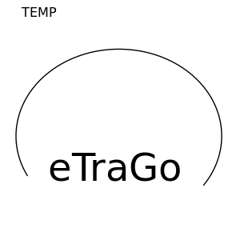

.. eTraGo documentation master file, created by
   sphinx-quickstart on Fri Sep 29 10:55:47 2017.
   You can adapt this file completely to your liking, but it should at least
   contain the root `toctree` directive.

Welcome to eTraGo's documentation!
==================================

.. warning:: Note, eTraGo and its documentation is in
             continuous development.

.. toctree::
   :maxdepth: 2
   
   about
   installation
   howToUse
   theoretical_background
   developer_notes
   whatsnew
   api

Indices and tables
==================

* :ref:`genindex`
* :ref:`modindex`
* :ref:`search`
