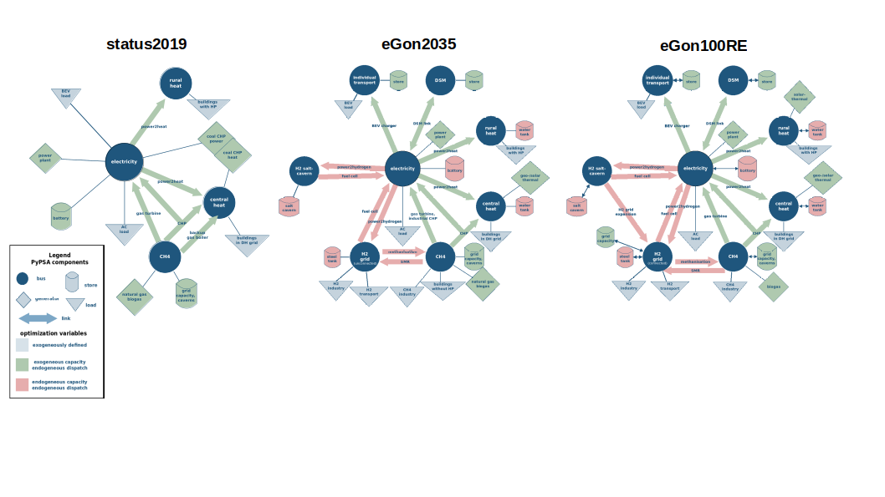

======================
Theoretical Background
======================

Definitions and Units
=====================

eTraGo is based on the open source tool `PyPSA <https://pypsa.readthedocs.io/en/latest/>`_ and uses its definitions and units.

Assumptions on Data
===================

eTraGo fetches the input data from the `OpenEnergy Platform <https://openenergy-platform.org/>`_. The data includes electricity and gas grid topology as well as data on energy supply and load for the considered sectors (electricity, gas, heat and e-mobility) plus data on flexibility potential deriving from those sectors e.g. Dynamic Line Rating, Demand Side Management and flexibility potentials arising from e-mobility. More details on the data model can be found in the documentaton of `eGon-data <https://egon-data.readthedocs.io/en/latest/>`_.

At the moment, there are two scenarios available basing on scenario C2035 of the network expansion plan ([NEP]_), version 2021. The base one is called eGon2035. To analyse the effect of flexibility options, there is an eGon2035_lowflex scenario available which depicts a lower penetration of flexibilities. More scenarios are being developed. The eGon100RE scenario is being implemented which is characterised by a 100% renewable generation. Analog to the scenario above, a eGon100RE_lowflex scenario will be available.

You can see the modeling concepts of the scenarios in the figure below. The components marked green have exogenous capacity and endogenous dispatch whereas the components marked in red are optimised endogenously in capacity and dispatch.

Methods
=======

Optimisation with PyPSA
-----------------------

Within eTraGo, the fetched data model is translated into a `PyPSA <https://pypsa.readthedocs.io/en/latest/>`_-network. The optimisation is performed with a linear approximation assuming eTraGo to fulfill the assumptions to perfom a LOPF (as those are small voltage angle differences, branch resistances negligible to their reactances, voltage magnitudes can be kept at nominal values) since it focuses on the extra-high and high voltage levels. As objective value of the optimisation, the overall system costs are considered.

With the argument ‘pf_post_lopf’, after the LOPF a non-linear power flow simulation can be conducted.

Complexity Reduction
---------------------

The data model is characterised by a high spatial (about 8,000 electrical and 600 gas nodes) and temporal resolution (8,760 timesteps). To reduce the complexity of the resulting optimisation problem, several methods can be applied.

Reduction in spatial dimension:
^^^^^^^^^^^^^^^^^^^^^^^^^^^^^^^^

The **ehv clustering** maps all electrical nodes with a voltage level below the extra-high voltage level to their nearest neighboring node in the extra-high voltage level with the Dijkstra’s algorithm (110 kV —> 220 / 380 kV).

The **k-means Clustering** reduces the electrical or gas network to an adjustable number of nodes by considering the geographical position of the respective nodes. This method has been implemented within PyPSA by [Hoersch]_.

The **k-medoids Dijkstra Clustering** aggregates nodes considering the network topology. First, a k-medoids Clustering is used dividing the original nodes of the network into groups by their geographical positions while identifiying the geographical medoid nodes per cluster. Afterwards, the original nodes in the original network are assigned to the former identified medoids considering the original network’s topology applying a Dijkstra’s algorithm considering the line lengths. Afterall, the original nodes are represented by one aggregated node per cluster at the position of the former identified medoid node.

In general, the clustering of the **sector-coupled system** is divided into two steps:
First, the electrical and gas grid are clustered independently using one of the methods described above. Afterwards, nodes of the other sectors (hydrogen, heat, e-mobility and DSM nodes) are mapped according to their connection to electricity or gas buses and aggregated to one node per carrier.

After optimising the spatially reduced network, a **spatial disaggregation** can be conducted. 

Reduction in temporal dimension:
^^^^^^^^^^^^^^^^^^^^^^^^^^^^^^^^^

The method **Skip Snapshots** implies a downsampling to every nth time step. The considered snapshots are weighted respectively to account for the analysis of one whole year.

By using the method called **Segmentation**, a hierarchical clustering of consecutive timesteps to segments with variable lengths is applied [Pineda]_.

The **Snapshot Clustering on Typical Periods** implies a hierarchical clustering of time periods with a predefined length (e.g. days or weeks) to typical periods. Those typical periods are weighted according to the number of periods in their cluster. This method optionally includes the linkage of the typical periods in a second time layer to account for the intertemporal dependencies following [Kotzur]_.

By applying a 2-level-approach, a **temporal disaggregation** can be conducted. This means optimising dispatch using the fullcomplex time series in the second step after having optimised grid and storage expansion using the complexity-reduced time series in the first step.

Grid and Storage / Store expansion
-----------------------------------

The grid expansion is realized by extending the capacities of existing lines and substations. These capacities are considered as part of the optimisation problem whereby the possible extension is unlimited. With respect to the different voltage levels and lengths, MVA-specific costs are considered in the optimisation. 

As shown in the figure above, several options to store energy are part of the modeling concept. Extendable batteries (modeled as storage units) are assigned to every node in the electrical grid. A minimum installed capacity is being considered to account for home batteries ([NEP]_). The expansion and operation is part of the optimisation. Furthermore, two types of hydrogen stores (modeled as stores) are available. Overground stores are optimised in operation and dispatch without limitations whereas underground stores depicting saltcaverns are limited by geographical conditions ([BGR]_). Additionally, heat stores part of the optimisation in terms of power and energy without upper limits. 

Miscellaneous Features
----------------------

Several features were developed to enhance the functionality of eTraGo. 

To customize computation settings, ‘solver_options’ and ‘generator_noise’ should be adapted. The latter adds a reproducible small random noise to the marginal costs of each generator in order to prevent an optima plateau. The specific solver options depend on the applied solver (e.g. Gurobi, CPLEX or GLPK). 

In ‚extendable‘ you can adapt the type of components you want to be optimised in capacity and set upper limits for gird expansion inside Germany and of lines to foreign countries.

The ‚extra_functionality‘-argument allows to consider extra constraints like limits for energy imort and export or minimal renewable shares in generation.

‘branch_capacity_factor’ adds a factor to adapt all line capacities in order to consider (n-1) security. Because the average number of HV systems is much smaller than the one of eHV lines, you can choose factors for ‘HV’ and ‘eHV’ separately. 

The ‘load_shedding’-argument is used for debugging complex grids in order to avoid infeasibilities. It introduces a very expensive generator at each bus to meet the demand. When optimising storage units and grid expansion without limiting constraints, the need for load shedding should not be existent. 

With ‘foreign_lines‘ you can adapt the foreign lines to be modeled as DC-links (e.g. to avoid loop flows).

References
==========

.. [NEP] Übertragungsnetzbetreiber Deutschland (2021):
    *Netzentwicklungsplan Strom 2035*, Version 2021, 1. Entwurf. 2021.
    
.. [Hoersch] Jonas Hoersch et al. (2017):
    *The role of spatial scale in joint optimisations of generation and transmission for European highly renewable scenarios*. 2017.
    `<https://arxiv.org/pdf/1705.07617.pdf>`_
    
.. [Pineda] Salvador Pineda et al. (2018):
    *Chronological Time-Period Clustering for Optimal Capacity Expansion Planning With Storage*. 2018.
    `<https://ieeexplore.ieee.org/document/8369128>`_

.. [Kotzur] Leander Kotzur et al. (2018):
    *Time series aggregation for energy system design: Modeling seasonal storage*. 2018.
    `<https://arxiv.org/pdf/1710.07593.pdf>`_

.. [BGR] Bundesanstalt fuer Geowissenschaften und Rohstoffe et al.  (2020):
    *nSpEE-DS - Teilprojekt Bewertungskriterien und Potenzialabschätzung*. 2020.
    `<https://www.bgr.bund.de/DE/Themen/Nutzung_tieferer_Untergrund_CO2Speicherung/Downloads/InSpeeDS_TP_Bewertungskriterien.pdf?__blob=publicationFile&v=3>`_
