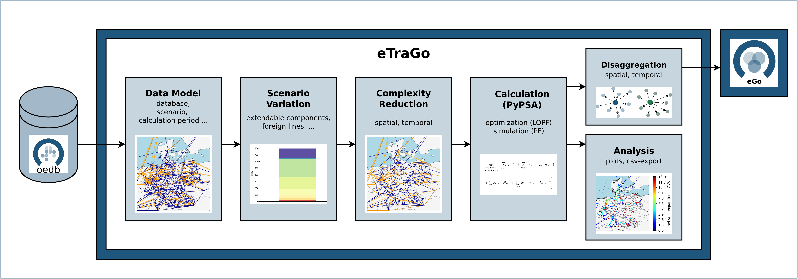
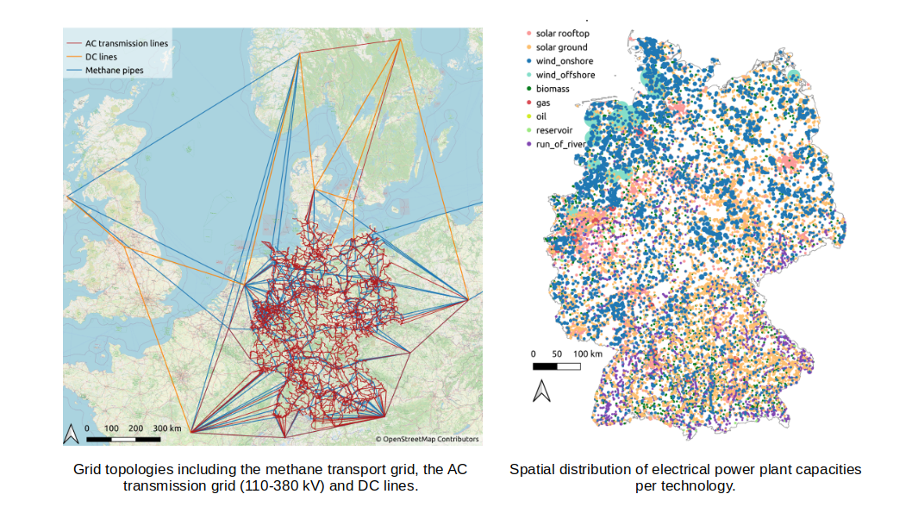
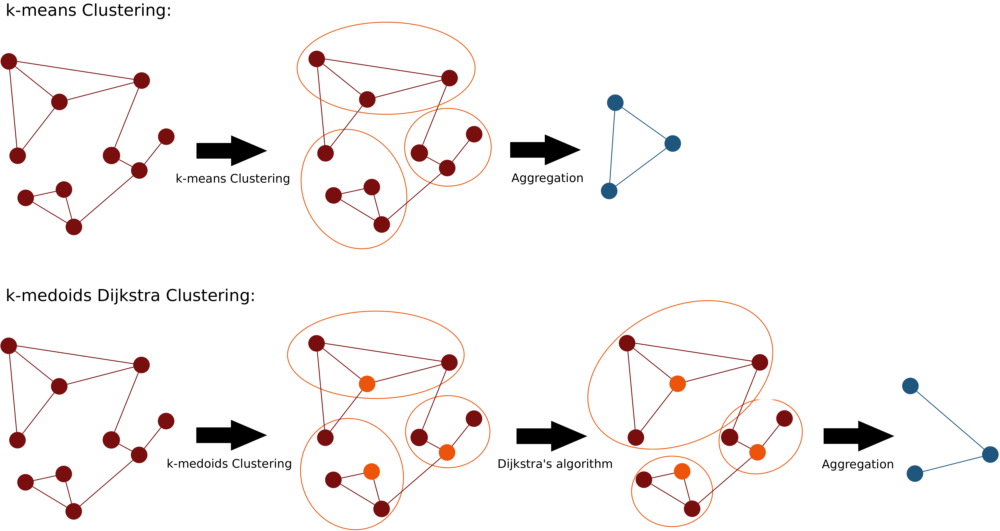
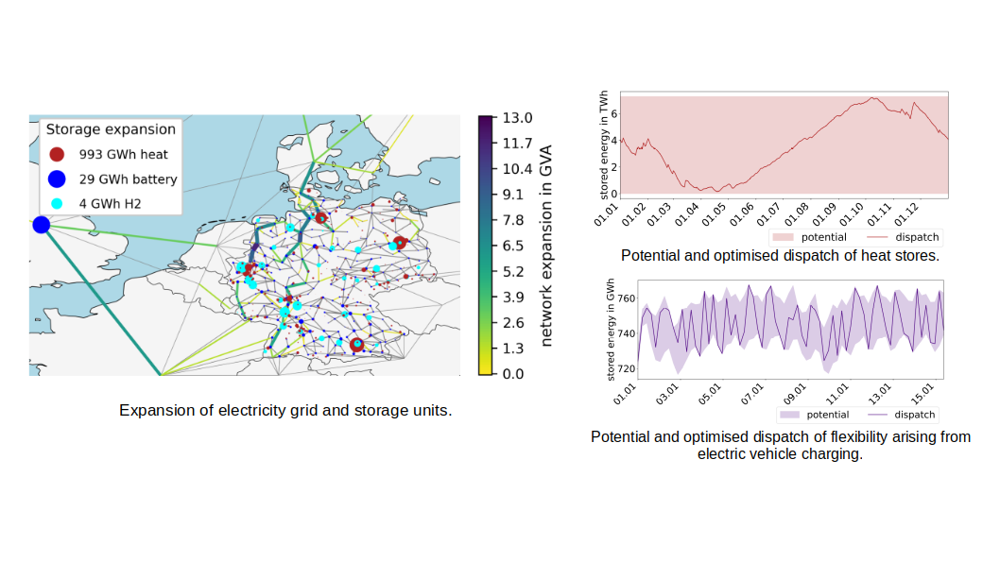

.. _Functionalities_ref:
===============
Functionalities
===============

*eTraGo* is based on the open source tool `PyPSA <https://pypsa.readthedocs.io/en/latest/>`_ and uses its definitions and units [PyPSA]_.

Data Model
==========

The input data covers the coupling of electricity grid models on different voltage levels with a gas grid model, demands and flexibilities from the mobility, heat and hydrogen sectors as well as the integration of other electrical flexibilities such as demand-side management and dynamic line rating. It is characterised by a high spatial resolution within Germany, while other countries are considered in an aggregated form. Several future scenarios have been developed, each covering one year in hourly resolution and differing in terms of generation, demand and availability of some technologies. The data model is generated using the tool *eGon-data*. More details on the model can be found in the documentation of `eGon-data <https://egon-data.readthedocs.io/en/latest/>`_ or the following publications: [eGon_report]_ and [Buettner2024]_. The graphs below give some impressions [eGon_report]_:

*eTraGo* fetches the input data from the `Open Energy Platform <https://openenergy-platform.org/>`_. Alternatively, different scenarios of the data models are available through `zenodo <https://zenodo.org/>`_. The data needs to be downloaded and locally stored as a PostgreSQL database to be accessable for *eTraGo*. More explanations can be found in the `zenodo upload <https://zenodo.org/records/8376714>`_. The following scenarios are available:

* `eGon2035 <https://zenodo.org/records/8376714>`_ basing on scenario C2035 of the network expansion plan ([NEP]_), version 2021
* eGon2035_lowflex as scenario variant of eGon2035 with lower penetration of flexibilities 
* eGon100RE (still under development) characterised by a 100% renewable generation 
* `status2019 <https://zenodo.org/records/13143969>`_ depicting the status in 2019

You can see the modeling concepts of the scenarios in the figure below. The components marked green have exogenous capacity and endogenous dispatch whereas the components marked in red are optimised endogenously in capacity and dispatch.

.. figure:: images/modelling_concept.png
   :align: center
   :width: 800

   
Scenario Variation
==================

Several features were developed to enhance the functionality of *eTraGo* and allow for adaptions within the scenarios introduced above.

* In ‚extendable‘ you can adapt the type of components you want to be optimised in capacity and set upper limits for grid expansion inside Germany and of lines to foreign countries.
* With ‘foreign_lines‘ you can adapt the foreign lines to be modeled as DC-links (e.g. to avoid loop flows).
* ‘branch_capacity_factor’ adds a factor to adapt all line capacities in order to consider (n-1) security. Because the average number of HV systems is much smaller than the one of eHV lines, you can choose factors for ‘HV’ and ‘eHV’ separately. 
* The ‚extra_functionality‘-argument allows to consider extra constraints like limits for energy imort and export or minimal renewable shares in generation.
* The ‘load_shedding’-argument is used for debugging complex grids in order to avoid infeasibilities. It introduces a very expensive generator at each bus to meet the demand. When optimising storage units and grid expansion without limiting constraints, the need for load shedding should not be existent. 

Complexity Reduction
====================

The data model is characterised by a high spatial (about 8,000 electrical and 600 gas nodes) and temporal resolution (8,760 timesteps). To reduce the complexity of the resulting optimisation problem, several methods can be applied.

Reduction in Spatial Dimension:
-------------------------------

The **ehv clustering** maps all electrical nodes with a voltage level below the extra-high voltage level to their nearest neighboring node in the extra-high voltage level with the Dijkstra’s algorithm (110 kV —> 220 kV / 380 kV).

The **k-means Clustering** reduces the electrical or gas network to an adjustable number of nodes by considering the geographical position of the respective nodes. This method has been implemented within PyPSA by [Hoersch]_.

The **k-medoids Dijkstra Clustering** aggregates nodes considering the network topology. First, a k-medoids Clustering is used dividing the original nodes of the network into groups by their geographical positions while identifiying the geographical medoid nodes per cluster. Afterwards, the original nodes in the original network are assigned to the former identified medoids considering the original network’s topology applying a Dijkstra’s algorithm considering the line lengths. Afterall, the original nodes are represented by one aggregated node per cluster at the position of the former identified medoid node.

The procedures of the two methods are depicted in the following figure [Esterl2024]_:

In general, the clustering of the **sector-coupled system** is divided into two steps:
First, the electrical and gas grid are clustered independently using one of the methods described above. Afterwards, nodes of the other sectors (hydrogen, heat, e-mobility and DSM nodes) are mapped according to their connection to electricity or gas buses and aggregated to one node per carrier.

Reduction in Temporal Dimension:
--------------------------------

The method **Skip Snapshots** implies a downsampling to every nth time step. The considered snapshots are weighted respectively to account for the analysis of one whole year.

By using the method called **Segmentation**, a hierarchical clustering of consecutive timesteps to segments with variable lengths is applied [Pineda]_.

The **Snapshot Clustering on Typical Periods** implies a hierarchical clustering of time periods with a predefined length (e.g. days or weeks) to typical periods. Those typical periods are weighted according to the number of periods in their cluster. This method optionally includes the linkage of the typical periods in a second time layer to account for the intertemporal dependencies following [Kotzur]_.

Calculation with PyPSA
======================

All optimization methods within *eTraGo* base on the Linear Optimal Power Flow (LOPF) implemented in `PyPSA <https://pypsa.readthedocs.io/en/latest/>`_.
The objective is the minimization of system costs, considering marginal cost of energy generation and investments in grid infrastructure, storage units and different flexibility options. The different options are specific for each scenario.

Currently, two different optimization approaches are implemented considering different conficgurations of energy markets and optimization variables. The different options are described in the following sections. 

Integrated optimization with nodal pricing
------------------------------------------

The objective is to minimize marginal cost of energy generation and investments in grid infrastructure, storage units and different flexibility options in one optmization problem. 
The following objective function is applied: 

.. math::
  :nowrap:

    \begin{gather*}
    \sum_{n,s} c_{n,s} \bar{g}_{n,s} + \sum_{n,s} c_{n,s} \bar{h}_{n,s} + \sum_{l} c_{l} F_l \\
    + \sum_{t} w_t \left[\sum_{n,s} o_{n,s,t} g_{n,s,t} + \sum_{n,s} o_{n,s,t} h_{n,s,t} \right]
    + \sum_{t} \left[suc_{n,s,t} + sdc_{n,s,t} \right]
    \end{gather*}

This implies a nodal pricing approach and optimal dispatch and redispatch. Redispatch and curtailment of renewable energy is possible, without any additional redispatch costs. 
Investments and expanded capacities of grid infrastructure, storage units and different flexibility options are a key result. It has to be noted that expansion is employed continiously. The expanded capacities not always refelect existing technical appliences. This allows to keep a linear optimization problem that is feasible for the described complex model. 

Various constrains are added to model the physical and electrical behavior. 

The integrated optimization results in highly cost-effective results, but does not reflect the acctual German energy market.
A more detailed description of this modelling apporoach as well as some results can be found in differnent studies and papers, e.g. in: [Mueller2019]_, [Buettner2024]_.

Consecutive market and grid optimization
----------------------------------------

This methodology aims to represent an energy market that is close to the acctual current market design by separateing the market model from the grid model. The optimization method consists of three consecutive steps. 
At first, seasonal storage behavior and market-based expansions of flexibility options are identified through a simplified yet annual calculation. The second step aims to come up with a realistic dispatch for each power plant and hour, taking into account non-linear Unit Commitment constraints and a short-term, rolling planning horizon. In both steps, the spatial resolution is defined by one node per current bidding zone.
In the last optimization step, the grid topology (potentially in a resuced spatial resolution as described in XX) is considered. This allows to optimize grid expansion. The market-based dispatch is defined by the previous step, redispatch and curtailment is possible, but results into additional system costs. 

A brief overview of the different optimization steps, their key characteristics and results is shown in the following figure. 
A detailed description of the methodology is given in [Buettner20242]_, which also presents and analyses results.

Grid and Storage / Store expansion
----------------------------------

The grid expansion is realized by extending the capacities of existing lines and substations. These capacities are considered as part of the optimisation problem whereby the possible extension is unlimited. With respect to the different voltage levels and lengths, MVA-specific costs are considered in the optimisation. 

As shown in the figure above, several options to store energy are part of the modeling concept. Extendable batteries (modeled as storage units) are assigned to every node in the electrical grid. A minimum installed capacity is being considered to account for home batteries ([NEP]_). The expansion and operation is part of the optimisation. Furthermore, two types of hydrogen stores (modeled as stores) are available. Overground stores are optimised in operation and dispatch without limitations whereas underground stores depicting saltcaverns are limited by geographical conditions ([BGR]_). Additionally, heat stores part of the optimisation in terms of power and energy without upper limits. 

Non-linear power flow
---------------------
With the argument ‘pf_post_lopf’, after the LOPF a non-linear power flow simulation can be conducted.

Solver Options
--------------

To customize computation settings, ‘solver_options’ and ‘generator_noise’ should be adapted. The latter adds a reproducible small random noise to the marginal costs of each generator in order to prevent an optima plateau. The specific solver options depend on the applied solver (e.g. Gurobi, CPLEX or GLPK). 

**Insights on Solver Settings with Gurobi**

* `threads <http://www.gurobi.com/documentation/8.0/refman/threads.html>`_: number of threads to apply to parallel algorithms (concurrent or barrier)

  * default: 0 (uses all cores in the machine)
  * reduce if parallel calculations or tight memory
* `method <http://www.gurobi.com/documentation/8.0/refman/method.html#parameter:Method>`_: algorithm used to solve optimization of lopf

  * default (-1, concurrent): chooses between simplex or barrier method due to matrix range
  * 1 (simplex): slower but less sensitive for numerical issues
  * 2 (barrier): fastest method but sensitive for numerical issues
* `crossover <http://www.gurobi.com/documentation/8.0/refman/crossover.html>`_ (barrier only): determines the crossover strategy used to transform the interior solution produced by barrier into a basic solution

  * default: -1 (chooses strategy automatically)
  * preferred: 0 (disables crossover, solves fastest but may need 'NumericFocus' and 'BarHomogenus' to avoid numerical issues)
* `BarConvTol <http://www.gurobi.com/documentation/8.0/refman/barconvtol.html>`_ (barrier only): the barrier solver terminates when the relative difference between the primal and dual objective values is less than the specified tolerance

  * default: 1e-8
  * preferred: 1e-5 (little less accurate, but solves faster)
* `FeasibilityTol <http://www.gurobi.com/documentation/8.0/refman/feasibilitytol.html>`_: tolerance of all constraints

  * default: 1e-6
  * preferred: 1e-5 (less accurate, but reduces number of iterations)
* logFile: destination and name of gurobi log file

  * default: None
  * preferred: 'gurobi_eTraGo.log'
* `BarHomogeneous <http://www.gurobi.com/documentation/8.0/refman/barhomogeneous.html>`_: (barrier only): determines whether to use the homogeneous barrier algorithm

  * default:  -1 (homogeneous barrier algorithm turned off, faster but sensitive for numerical issues)
  * preferred: 1  (homogeneous barrier algorithm turned on, bit slower but less sensitive for numerical issues, often used when crossover turned off)
* `NumericFocus <http://www.gurobi.com/documentation/8.0/refman/numericfocus.html>`_: controls the degree to which the code attempts to detect and manage numerical issues

  * default: 0 (automatic choice with a slight preference for speed)
  * 1 - 3 (shift the focus towards being slower but less sensitive for numerical issues)

Disaggregation
==============

By applying a 2-level-approach, a **temporal disaggregation** can be conducted. This means optimising dispatch using the fullcomplex time series in the second step after having optimised grid and storage expansion using the complexity-reduced time series in the first step. More information can be found in the master thesis by [Esterl2022]_.

Afterterwards, a **spatial disaggregation** can be conducted distributing power plant and storage utilisation time series, the expansion of storage facilities and the use of flexibility options over the original number of nodes. The expansion of the transmission grid is not disaggregated and remains at the reduced spatial resolution. The methodology is explained in [eGon_report]_.

Analysis
========

*eTraGo* contains various functions for evaluating the optimisation results in the form of graphics, maps and tables. Functions to quantify results can be found in :meth:`etrago.analyze.calc_results<etrago.analyze.calc_results>` and functions to plot results can be found in :meth:`etrago.analyze.plot<etrago.analyze.plot>`.
Some examplary graphs by [Buettner2024]_ are presented below:

   

