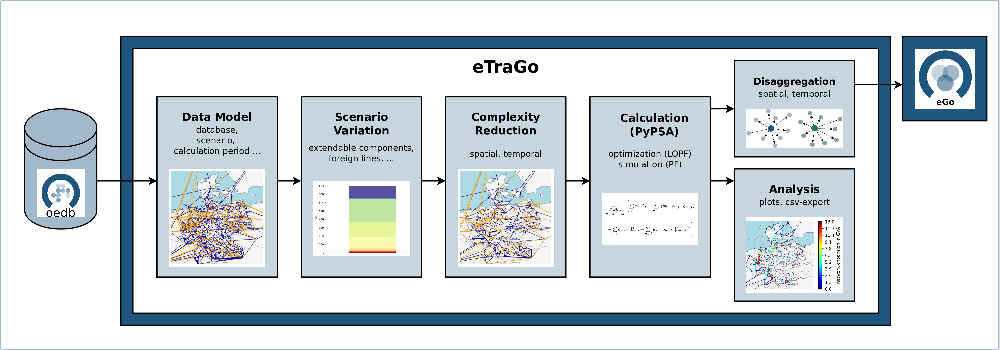
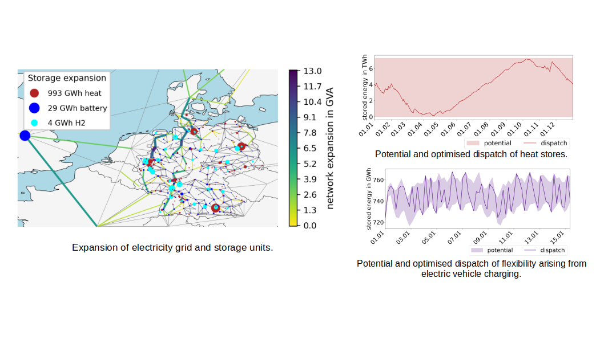

# Summary

`eTraGo` is an open source Python tool designed for analyzing the energy system transformation considering electrical grids. It enables electricity grid planning on extra-high and high voltage grid levels, optimizing grid and storage expansion as well as power plant dispatch. `eTraGo` thereby considers sector coupling and includes the possibility of taking into account various flexibility options. These include flexibilities arising from sector coupling, such as heat stores, gas stores, or shifting electric vehicle charging times, as well as electrical flexibilities like demand-side management and dynamic line rating.
`eTraGo` is also compatible with the open source tool `eDisGo` [@edisgo] through the grid planning tool `eGo` [@ego], enabling consistent grid and flexibility optimization across all voltage levels.

# Statement of need

Transforming the energy system is vital for achieving a climate-friendly and environmentally sustainable future. Therefore, electricity generation shifts from conventional, centralized sources to decentralized, often weather-dependent, renewable sources. Within Germany, the transmission grid experiences significant stress due to the presence of substantial wind energy capacity in the rural northern regions, which is in contrast to the industrial demands located mainly in the central and southern regions.
Meanwhile, the decarbonization of many other sectors, such as the mobility sector or the heating sector, can be achieved most efficiently through electrification. As a result, the fluctuating, weather-dependent feed-ins are offset by increased demand and changed demand patterns due to the advancing sector coupling. 

Therefore, electrical grids must be further developed and adapted to the new requirements.
However, scaling technologies such as battery storage units can support the grid if dispatched grid-friendly.
In addition, the integration of other sectors presents novel opportunities for flexibility, which can be exploited to reduce the necessity for grid expansion [@Brown2018; @openego-publication; @FRIDGEN2020; @Gils2021; @Goke2023; @etrago-results]. 

These developments require careful investigation within holistic analyses to obtain robust solutions for an efficient future system. There is a consensus among researchers that this includes analyses with high temporal and spatial resolution [@pfen-models; @challenges2; @review_complexity; @review_spatial; @challenges]. Furthermore, cross-grid level analyses are becoming increasingly necessary [@rossini_flexplanjl_2023; @endbericht_egon]. At the same time, transforming the energy system is an important and challenging task that we need to tackle as a collective endeavor. This is why stakeholders and experts need to have access to data and tools. Transparency and accessibility enable important discourse to identify and realize targeted measures on the path to a clean energy system.

`eTraGo` enables integrated analyses across the extra-high and high voltage grid levels, with the option to extend to the remaining lower voltage grid. It co-optimizes grid and storage expansion needs, considering a variety of flexibility options to achieve a cost-optimal, system-wide energy system.
Thereby, it offers various functionalities to manage high spatial and temporal resolution. As an open-source tool, it provides valuable support to various stakeholders in identifying suitable transformation pathways.

A range of open-source and proprietary tools exists for power and energy system modeling, each with different regional scopes and technical depths. A multitude of open-source frameworks have been developed for the analysis of energy and power systems. These include `PyPSA`, `pandapower`, and `OEMOF`. `pandapower` is a software that provides detailed electrical grid modeling capabilities [@pandapower.2018]. However, it is more technically oriented and not fully open source in all functionalities. In contrast, the objective of `OEMOF` is to optimize energy systems across all sectors of the energy industry [@Hilpert2018]. The consideration of electrical grids is permissible; however, it is imperative to exclude physical boundaries, such as passive AC branch flows, from the analysis. These boundaries are indispensable for the effective modeling of transmission grids.
`PyPSA` provides a versatile foundation for techno-economic energy system analysis, incorporating physical boundaries [@pypsa]. `eTraGo` is built directly on the methods and data structures of `PyPSA`.

Several tools have been developed with a specific application to Germany or Europe. `ReMOD` models long-term transition scenarios for Germany, published results consider ten regions in Germany [@Brandes2024]. The GAMS-based tools `ReMix` and `DIETER` focus on the energy system planning of Germany. `DIETER` does not take into account the electricity network, and therefore does not consider network congestion [@Schill2020]. `ReMix` considers the exchange of electricity between regions by DC-OPFs [@Wetzel2024]. In @Gils2021, `ReMix` is applied to model the German grid clustered to ten regions, bottlenecks within these clusters are not visible. 
`PyPSA-Eur` and `PyPSA-DE` extend `PyPSA` to continental and national scales [@Horsch2018-et; @ariadne-report]. Both tools have been developed for mid- and long-term planning of the energy system. Electrical grids are considered on extra-high voltage level, an explicit interface to distribution grids is not implemented [@Horsch2018-et; @ariadne-report].

`eTraGo` extends this landscape by enabling integrated, detailed analyses across extra-high and high-voltage levels, which can be extended to lower grids. It co-optimizes grid and storage expansion while capturing diverse flexibility options at a high temporal and spatial resolution.

# Software design

`eTraGo` is an open source tool based on `PyPSA` [@pypsa]. The primary entry point for executing `eTraGo` is the script `appl.py`, which defines the central configuration via the argument dictionary (`args`). These arguments must be specified by the user in order to determine the scenario configuration, model parameters, and calculation methods. Alternatively, the `args` dictionary can be provided and modified through an external `JSON` configuration file.

A comprehensive understanding of the available parameters is essential to ensure a consistent and intended model setup. Based on the selected settings, `appl.py` executes the `eTraGo` workflow. The overall functionality is structured into modular components. An overview of these modules is provided in \autoref{fig:functionalities}. The individual processing steps are outlined briefly in the following sections, while a more detailed technical description is available in the project documentation (read-the-docs).

{ width=100% }

`eTraGo` is compatible with open sector-coupled **data models, representing different scenarios** of the German Energy system generated by `eGon-data` [@eGon-data2023a]. These models include electricity grid models from extra-high and high down to medium and low voltage grid levels, and are therefore characterized by a high spatial and temporal resolution within Germany. Depending on the specific scenario, the data models also cover gas grid models. Furthermore, they encompass sectoral demands and flexibilities from electricity, gas, heat, and mobility systems. Several scenarios are available to be used within `eTraGo`, e.g. a status quo scenario, a mid-term scenario for 2035 or a scenario characterized by 100% renewable generation.
`eTraGo` includes methods to **customize these scenarios**, e.g. by selecting components that are optimized in terms of capacity. 

The grid model is characterized by a high spatial (about 8,000 electrical nodes) and temporal resolution (8,760 timesteps). To **reduce the complexity** of the resulting optimization problem, several methods can be applied to reduce the data complexity in spatial and temporal dimensions [@dijkstra-paper].

`eTraGo` provides different options to **optimize the transmission grid** and its expansion needs. The energy market can be integrated into the grid optimization with nodal pricing [@etrago-results] or as a separate optimization step, allowing the consideration of current market regions [@redispatch-paper]. When a separate market optimization is conducted, the grid optimization encompasses cost-based redispatch.
Within both approaches, linearized optimal power flows are conducted to optimize grid and storage expansion, flexibility dispatch, and (re)dispatch of generation in one optimization problem. The objective is to reduce overall system costs.
Various constraints model the technical behavior, e.g. AC-load flows or weather-dependent limits for renewable generation.
A non-linear **power flow simulation** can be conducted afterwards to check the technical feasibility of the optimized dispatch and expansion results.

The optimization results can be **disaggregated in both temporal and spatial dimensions**. This is especially required when results should be transferred to `eDisGo` [@edisgo] to allow consistent grid and flexibility optimization across all grid levels [@ego-paper].

In addition, `eTraGo` is equipped with a range of functions that facilitate the **analysis of optimization results** in graphical, cartographic, and tabular formats. Examples from [@etrago-results] are given in \autoref{fig:results}.

{ width=100% }

# Research impact statement

`eTraGo` was initially developed and has since been continuously further developed within several research projects, most prominently [open_eGo](https://openegoproject.wordpress.com), [eGon](https://ego-n.org/), [reGon](https://rego-n.org/), and [PoWerD](https://www.h2-powerd.de/). Beyond the methodological development of the tool itself, these projects have applied `eTraGo` to address different research questions related to future energy system transformation, e.g.  the requirements for grid and storage expansion under various future scenarios for Germany, as well as to assess the integration and utilization of emerging flexibility options. The following presents a selection of representative scientific publications:

* *Challenges of top–down flexibility deployment for grid expansion across all voltage levels* [@ego-paper]
* *The impact of redispatch on grid and storage expansion planning in the German energy system* [@redispatch-paper]
* *Avoiding False Inter-Zonal Meshing in the Clustering of a Large-Scale German Power Grid* [@dijkstra-paper]
* *Influence of flexibility options on the German transmission grid — A sector-coupled mid-term scenario* [@etrago-results]
* *Integrated Techno-Economic Power System Planning of Transmission and Distribution Grids* [@openego-publication]
* *The eGo grid model: An open source approach towards a model of German high and extra-high voltage power grids* [@mueller20181]
* *The Role of the High Voltage Power Level in Future Power Systems and Their Modelling* [@Mueller20182]

Beyond its application in scientific research, `eTraGo` is increasingly employed in applied economic projects, for example, by the _NetzWende Agentur_, a spin-off of Hochschule Flensburg and Europa-Universität Flensburg. 
Within these contexts, `eTraGo` is applied, for example, to identify suitable locations for energy storage deployment and to determine optimal operational strategies for battery storage systems, as further described on the [website of NetzWende Agentur](https://netzwende-agentur.de/referenzen/).

# AI usage disclosure

The utilization of generative artificial intelligence has been employed to enhance the quality of text in both paper and tool documentation. The authors have conducted a comprehensive review of the results, ensuring the accuracy and integrity of the resulting texts. The responsibility for ensuring the accuracy of the information provided lies with the authors. 

# Acknowledgements

We want to express our sincere gratitude to all scientific staff, students, and external collaborators who have contributed to the development of this tool. We would especially like to thank Stephan Günther, Lukas Wienholt, Julian Bartels, Francesco Witte, Hendrik-Pieter Tetens and Amélia Nadal for their contributions.

We thank the Federal Ministry for Economic Affairs and Energy for funding the research projects `open_eGo`, `eGon`, `PoWerD` and `reGon`.

We also gratefully acknowledge the PyPSA community for providing an open, collaborative, and continuously improving ecosystem that has supported and inspired our work.

# References
